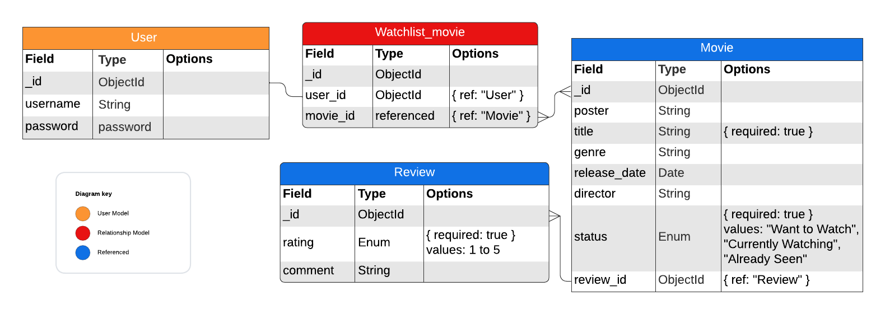
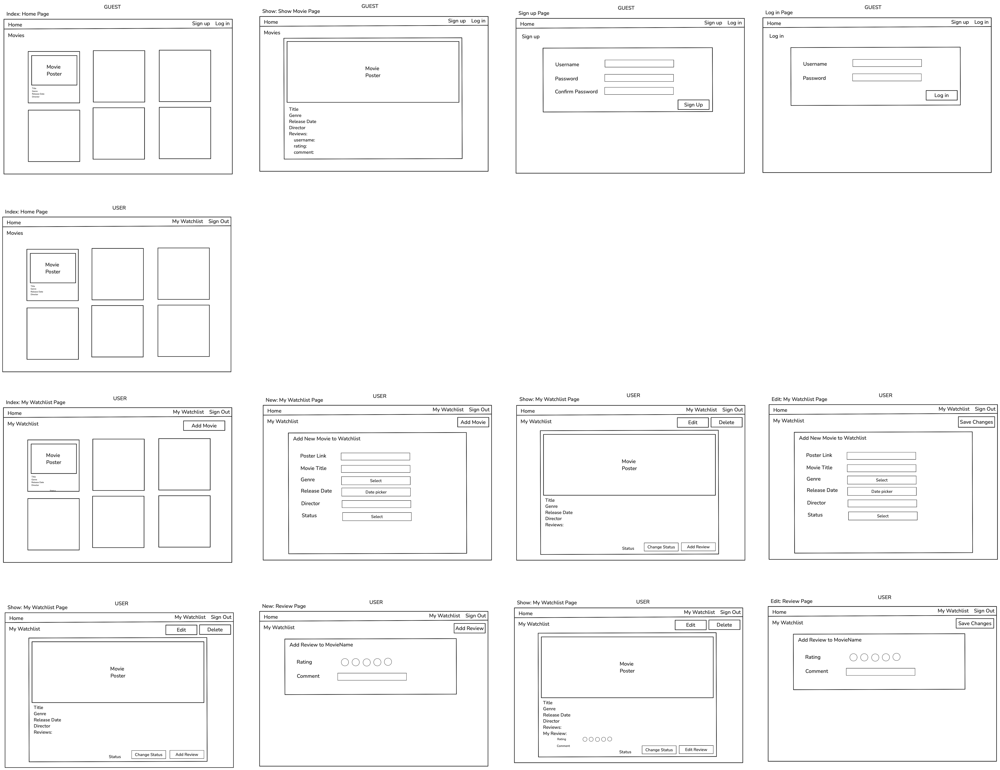

# Movie Watchlist

## Overview
The Movie Watchlist Tracker is a CRUD web application designed to help users manage their movie-watching journey. Users can track movies they want to watch, are currently watching, or have already seen. The app allows users to leave ratings and reviews for movies they have watched, making it a comprehensive tool for movie enthusiasts.

## Features
- User registration and authentication
- Add movies to a single watchlist
- Update movie status: Want to Watch, Currently Watching, Already Seen
- Review and rate movies
- View complete watchlist
- Explore and view movies from other users
- Delete movies from the watchlist

## User Stories

1. **User Registration and Login**
   - As a new user, I want to register for an account so that I can create my own movie watchlist.
   - As a returning user, I want to log in securely so that I can access my saved watchlist.

2. **Add Movies to Watchlist**
   - As a user, I want to add a movie to my watchlist so that I can keep track of movies I plan to watch.
   - As a user, I want to have a status on each movie as "Want to Watch," "Currently Watching," or "Already Seen."

3. **Update Movie Status**
   - As a user, I want to update the status of a movie to "Currently Watching" or "Already Seen" so that my watchlist accurately reflects my viewing progress.

4. **Review and Rate Movies**
   - As a user, I want to add a rating and a review to movies I’ve marked as "Already Seen" so that I can remember my thoughts and impressions of the movie.
   - As a user, I want to edit my review or rating in case my opinion changes after rewatching the movie.

5. **View Watchlist**
   - As a user, I want to view my entire watchlist on a single dashboard so that I can quickly see all the movies I’ve added and their statuses.

6. **Explore Movies**
   - As a user/guest, I want to explore other users' movies listed and their reviews.

7. **Delete Movies from Watchlist**
   - As a user, I want to remove a movie from my watchlist if I no longer want to watch it so that my list stays relevant and organized.

## Technical Stack
- **Frontend**: HTML, CSS, JavaScript (with a library/framework such as React or Vue.js)
- **Backend**: Node.js, Express.js
- **Database**: MongoDB

## Pseudocode

### **Add Movie to Watchlist**
```plaintext
FUNCTION addMovieToWatchlist(userID, movieID):
    CREATE new Watchlist_movie with userID and movieID
    RETURN "Movie added to watchlist."  
```

### **Update Movie from Watchlist**
```plaintext
FUNCTION updateMovie(movieID, title, genre, release_date, director, status):
    IF status NOT IN ["Want to Watch", "Currently Watching", "Already Seen"] THEN
        RETURN "Invalid status."
    IF movieID NOT found THEN
        RETURN "Movie not found."
    UPDATE movie WHERE id = movieID WITH:
        title = title,
        genre = genre,
        release_date = release_date,
        director = director,
        status = status
    RETURN "Movie details updated."
```

### **Delete Movie from Watchlist**
```plaintext
FUNCTION deleteMovieFromWatchlist(movieID):
    DELETE movie WHERE id = movieID
    RETURN "Movie removed from watchlist."
```

### **Add Review and Rating**
```plaintext
FUNCTION addReview(userID, movieID, rating, comment):
    IF rating NOT IN [1, 2, 3, 4, 5] THEN
        RETURN "Invalid rating."
    IF movie status != "Already Seen" THEN
        RETURN "Movie must be marked as 'Already Seen' to add review."
    IF user has already reviewed this movie THEN
        RETURN "You have already reviewed this movie."
    CREATE new Review with userID, movieID, rating, and comment
    RETURN "Review and rating added."
```

### **View Watchlist**
```plaintext
FUNCTION viewWatchlist(userID):
    watchlist = GET all movies WHERE userID = userID
    RETURN watchlist
```

### **Explore Movies**
```plaintext
FUNCTION exploreMovies():
    allMovies = GET all Movies
    RETURN allMovies
```

## Database Schema (ERD Diagram)
The database schema consists of three main tables: Users, Movies, and Reviews. The Users table stores user information, the Movies table stores movie details and status, and the Reviews table stores user reviews and ratings for movies. The Watchlist_movies table is a junction table that connects Users and Movies to create a many-to-many relationship.




## Movie Watchlist Wireframe Mockups
The wireframe mockups for the Movie Watchlist are displayed below. The mockups show the user interface for the main features of the application, including the user registration and login page, the movie details page, and the explore movies page:



## Attribution
- [General Assembly Auth Template](https://github.com/SEB-1-Bahrain/instructor-men-auth.git)